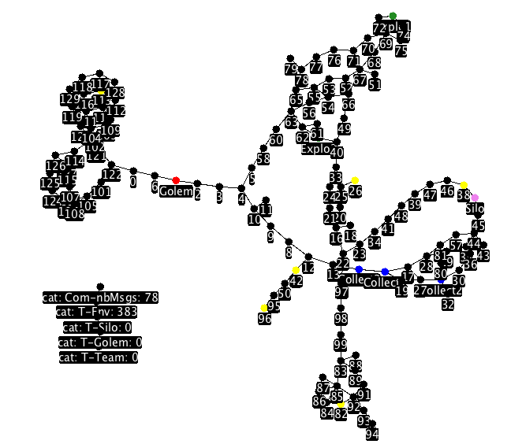

# Wumpus Multi-agent

## Auteure

Etudiante :

* Lachiheb Sarah

Sorbonne Université (SU) 2019 

## Préambule

Le projet multi-agent a été développé tout au long du semestre de Master 1 au sein de la Sorbonne Université (Pierre et Marie Curie). Il s’agit de mettre en place
une version **multi-agent** d’un jeu inspiré de  Hunt the Wumpus , en utilisant la **plateforme
multi-agent JADE**.

Dans ce projet, nous cherchons à mettre en place une variante de ce jeu dans laquelle un ensemble d’agents ici, "Explorateur", "Collecteur", "Silo versus Tanker" et "Golem" doivent explorer un environnement inconnu et collecter des trésors disséminés dans cet environnement. Le but des agents est de maximiser la quantité de trésors collectés et rapportés à un agent  silo. Seuls les trésors possédés par cet agent spécifique seront pris en compte afin de calculer le score de performance de la collecte.

### Rendus :

Pour plus de lisibilité du rapport, il est préférable de télécharger les documents pour éviter le changement d'ordre des pages survenu lors du téléchargement sur le gitLab.

| Fichiers |
| :-------------  |
| [Rapport](https://gitlab.com/ProjetLachiheb/wumpus_multiagent/blob/master/Rapport/rapport.pdf)|
| [Annexes](https://gitlab.com/ProjetLachiheb/wumpus_multiagent/blob/master/Rapport/Annexe.pdf)|

## Installation préalable 

Il est nécessaire d'importer au préalable les librairies Cplex studio pour le fonctionnement du projet.

Pour exécuter le programme, lancer "Eclipse" et selectionner le fichier Principal.java présent dans le dossier "princ", puis faire un clic droit sur celui-ci en selectionnant "run as../Java application", tout en n'oubliant pas de mettre le chemin "-Djava.library.path="path"/cplex/bin/"system" dans le VM arguments pour le lien Cplex.

### Visualisation de l'interface :

Dans cette illustration, il y 7 agents en place sur la plateforme Jade avec 2 Explorateurs, 3 Collecteurs, 1 Silo et un Golem. 

* Comm-nbMsgs : Nombre de communication émis entre agents cognitifs.
* T-Env : Quantité de ressource encore disponible sur la carte.
* T-Silo : Quantité de ressource receptionée par l'agent Silo.
* T-Golem : Quantité de ressource volé par l'agent Golem.
* T-Team : Score de la Team.

## Code sources

| Type de dossier | Répertoire correspondant |
| :-------------  | :------------------------|
| Agents | [click here](https://gitlab.com/ProjetLachiheb/wumpus_multiagent/tree/master/code_DedaleEtuFull2018/src/eu/su/mas/dedaleEtu/mas/agents/yours)|
|Comportements | [click here](https://gitlab.com/ProjetLachiheb/wumpus_multiagent/tree/master/code_DedaleEtuFull2018/src/eu/su/mas/dedaleEtu/mas/behaviours/yours)|
| Connaissances | [click here](https://gitlab.com/ProjetLachiheb/wumpus_multiagent/tree/master/code_DedaleEtuFull2018/src/eu/su/mas/dedaleEtu/mas/knowledge/yours)|
